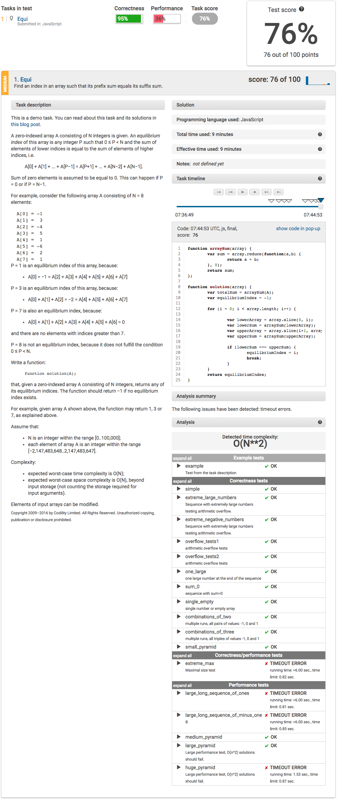

# Codility - Equi
I've put up my attempt at Codility's demo test here so potential employers can better understand the way I approach tackling problems when writng my code.

My solution can be found in codility-equi.js in this repo.

This is how Codility grades the code I've written:

The perfect solution provided by Codility can be found [here](http://blog.codility.com/2011/03/solutions-for-task-equi.html).

# Challenges & future areas of improvement
What I found challenging were the time constraint (I instead read the question, closed the test, and then came back to write my completed solution after spending my own time writing the solution in JSbin) as well as understanding the way the challenge is explained.

I felt the challenge itself is was simpler than how it was worded, perhaps intentionally so as part of the test.

Time and space complexity was something that I haven't really learnt to account for when coding (which is why I lost points on performance tests). I plan to learn to write more efficient code in the future.